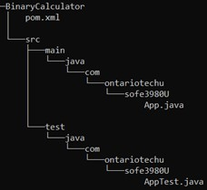
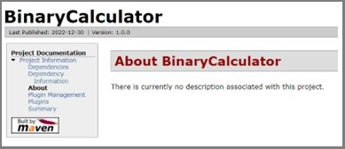
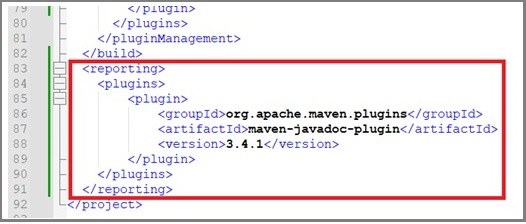
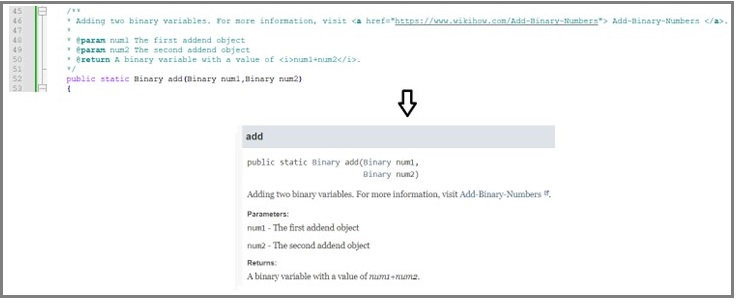
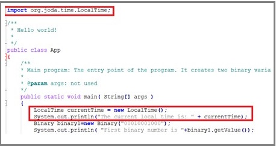
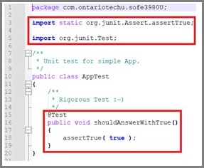
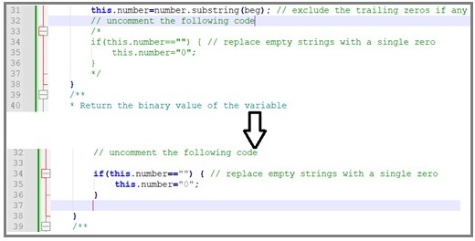
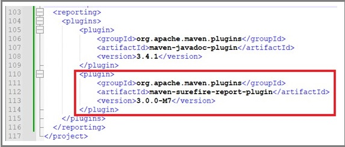

# Lab 1: Software Project Management and Comprehension Tool (Apache Maven)
## repostory link
https://github.com/GeorgeDaoud3/SOFE3980U-Lab1.git
## Objective: 
1. Install Maven in Windows OS.
2. Be familiar with Maven as a software project management tool.
3. Understand how to create, configure and build Maven projects.
4. Be able to automatically generate Documentation of the project.
5. Be able to configure the project to automatically add dependencies to the jar file.
6. Learn how to write and run tests a the project.
## What’s Maven?
It’s A tool for building and managing any type of java-based project.
It also can be used to build projects written in C#, Scala, Ruby, etc. 
Maven not only automatically handles the requirements for the project 
like downloading the dependencies, but it also automates most of the 
development tasks in the project like:
* Builds
* Dependencies
* Report
* Distribution
* Releases
* Mailing list
## Maven Installation
* Have a JDK installed on your system. It should satisfy [the minimum requirement](https://maven.apache.org/download.cgi#system-requirements). 
* Set the **JAVA_HOME** environment variable pointing to your JDK installation. 
    1.	On the Windows taskbar, right-click the **Windows icon** and select **System**.
    2.	In the Settings window, under **Related Settings**, click **Advanced system settings…** .
    3.	On the **Advanced** tab, click **Environment Variables…** .
    4.	Click **New** to create a new environment variable for the current user.
    5.	Set the **Variable name** to **JAVA_HOME** and the **Variable value** to the installation path (it would be different than that shown in the figure). The **bin** folder containing **java.exe** should be accessed by the path.  
      
    6.	To check it, open a new command window and execute  
    ``` cmd
    echo %JAVA_HOME%
    ```
    It should display the JDK path
* Download the **Binary zip archive** format of [Maven](https://maven.apache.org/download.cgi#files) then uncompress it to a certain folder.
* Add the Maven path to the system path
    1.	Go to the **Environment variables** for the user as you did before.
    2.	Find an existing **Path** Variable. Then click **edit**.
    3.	Add a new record of the path of the **bin** folder within the **Maven** folder. (the path would like different than that shown in the figure)  
      
* Check the correct Installation, by running the following command in a new command window (Note any change in the user variables will effect only new command windows)  
``` cmd
mvn -v
```
It should display an output similar to  

## Creating a project
* Within a command window, change the directory to the folder in which you want to create the project (replace **projects_root** with the actual path of the folder)  
``` cmd
cd <projects_root>
```
* Create a new project using the following command  
``` cmd
mvn archetype:generate^
    -DgroupId=com.ontariotechu.sofe3980U ^
    -DartifactId=BinaryCalculator^
    -Dversion=1.0.0^
    -DarchetypeArtifactId=maven-archetype-quickstart^
    -DarchetypeVersion=1.4^
    -DinteractiveMode=false  
```
&nbsp;&nbsp;&nbsp;&nbsp;This is a multiline single command. Appending each line by **^** indicates that the command is not ended, and it will be extended to the next line. **archetype:generate** specify that the command will generate a new project. **maven-archetype-quickstart** and **1.4** are template type and template version, respectively. The specified template will be used to create the project. While **DgroupId**, **DartifactId**, and **Dversion** are the group id, project name, and project version, respectively. Group id is a unique Identification for different projects within an organization.  
&nbsp;&nbsp;&nbsp;&nbsp; The command will create a folder with the same name as the project (**BinaryCalculator**). Within the project folder, a Project Object Model (POM) file (**pom.xml**) is created that contains a configuration script that controls the development cycle of the project. Also, a folder called **src** is created that contains two sub-directories, **main** for the source code and **test** for the testing code. The sub-folder names within both the main and test folders follow the **DgroupId** argument used to generate the project as shown in the following figure.  
  
&nbsp;&nbsp;&nbsp;&nbsp; A default HelloWorld java App will be created for you (**App.java**) as well as a default test file (**AppTest.java**). You can edit the files using any text editor. The content of the App.java file should look like this:  
   
## Building the project:
* Change the directory to the path of the pom.xml file  
``` cmd 
cd BinaryCalculator
```
* Run the following command  
``` cmd
mvn clean package
```
&nbsp;&nbsp;&nbsp;&nbsp; the first argument (**clean**) will remove any previously generated output while the **package** argument will rebuild the project and produce a jar file for the whole project. During the packaging process, the tests will be executed. All tests should be passed to complete the building process. All outputs including the jar file will be saved at the path (**BinaryCalculator\target**). The name of the built jar file will follow the pattern **DartifactId-Dversion.jar**. Thus it should be **BinaryCalculator-1.0.0.jar** for this project.
## Running the project
* Running the project using the jar file has many advantages especially if your project consists of multi-files and has dependencies that needed to be downloaded and added to the project. To run the project, invoke the following command within the command window (assuming the current directory is still BinaryCalculator)  

``` cmd
java -cp target/BinaryCalculator-1.0.0.jar  com.ontariotechu.sofe3980U.App
```  

where **target/BinaryCalculator-1.0.0.jar** is the relative path of the jar file while **com.ontariotechu.sofe3980U.App** is the main class of the project.  
* To be able to execute the jar file without specifying the main class, update the **pom.xml** file and specify the main class within it. To do this add the following script to the **maven-jar-plugin** tag as shown in the next figure  

```xml
<configuration>
 	<archive>
 		<manifest>
 			<addClasspath>true</addClasspath>
 			<mainClass>com.ontariotechu.sofe3980U.App</mainClass>
 		</manifest>
 	</archive>
</configuration> 
```  

&nbsp;&nbsp;&nbsp;&nbsp;**Note:** The final version of pom.xml is given in the GitHub repository.  

&nbsp;&nbsp;&nbsp;&nbsp;  

* Save the file and rebuild the project using  
``` cmd
mvn clean package
```
* Now, the main class is specified within the jar file. To execute the project, you should only run the jar file using the following command  
``` cmd
java -jar target/BinaryCalculator-1.0.0.jar
```

## Adding Source files to the project
* Copy the files from folder **v1** from the GitHub repository to the path **src/main/java/com/ontariotechu/sofe3980U/** . 
The **Binary.java** file contains a Binary class that stores the binary value as a string. The class has three functions
    1.	A **Constructor** that takes a string of the binary value
    2.	A **getValue()** function that returns the value of the binary variable
    3.	A static **add()** function that adds two binary variables and returns the result as a binary value.
The second file is an upgrade to the **App.java** file in which two binary variables are created then their summation is calculated and printed.
* By putting the files in the **src** folder, they will be automatically added to the project and will be compiled. Rebuild the project using the following command    
``` cmd
mvn clean package
```
* As the main class remains the same, no changes are needed to be done to the pom.xml file. Now, run the upgraded project  
``` cmd
java -jar target/BinaryCalculator-1.0.0.jar
```
The output should look like  
  
## Generate Documentation for the project
* To Generate documentation of the project, execute the following command  
``` cmd
mvn site
```
This will execute the site lifecycle to create a summary of the project in a set of HTML files. The HTML files can be accessed by opening the **index.html** file locates in **target/site/** using a browser. It should look like  

   

* To use the [Javadoc tool](https://www.oracle.com/ca-en/technical-resources/articles/java/javadoc-tool.html) to generate documentation of your code as well as the project, we have to add the maven-javadoc-plugin to the reporting phase of the development cycle in the pom.xml files. After the end of the build tag, add the following script  

``` xml
<reporting>
	<plugins>
		<plugin>
			<groupId>org.apache.maven.plugins</groupId>
			<artifactId>maven-javadoc-plugin</artifactId>
			<version>3.4.1</version>
		</plugin>
	</plugins>
</reporting>
```  

as shown in the figure  
  
* Now regenerate the summary again by executing  
```cmd
mvn site
```
A new menu item called **Project Reports** should appear in the generated **index.html** file  
  
* Click **Project Reports**, then **Javadoc**. Finally, choose **Binary** and explore the generated document. Note that that document is generated according to the comments in the source code. For example, in the following figure shows both the Javadoc comment of the **add** function in the source code and the corresponding generated documentation.  
  
## Add Dependencies
* **org.joda.time** provides a better representation of time than the standard date and time java classes. The **App.java** file in **v2** directory in the GitHub repository uses this library to print the local file at the begining of the main function.  
  
* Replace the **App.java** file located at **src/main/java/com/ontariotechu/sofe3980U/** by the **App.java** from the **v2** directory at the GitHub repository.
* Rebuild the project and regenerate the documentation by executing  

``` cmd
mvn clean package site
```

As the **org.joda.time** library does not exist yet in the project, the build process should fail.
* To fix this issue, the library should be specified in the **pom.xml** file so that It will be automatically downloaded and included in the project. Thus, add the following script to the pom.xml file within the dependencies tag.  

``` xml
<dependency>
	<groupId>joda-time</groupId>
	<artifactId>joda-time</artifactId>
	<version>2.9.2</version>
</dependency>
```

Note: If Maven can’t find the libraryin Maven repository, you have also to add the URL of the library repository.

* Save **pom.xml** and rebuild the project.  

``` cmd
mvn clean package site
```

This will generate a jar file without error, but the library will not be included in the jar file. Thus, an exception will be thrown if you tried to run the jar file   
* To create another version of the jar file in which all dependencies are included, add the **maven-assembly-plugin** that implements the **assembly:single** lifecycle to **pom.xml**.

``` xml
<!-- assembly lifecycle, generate jar with dependencies-->
<plugin>
	<artifactId>maven-assembly-plugin</artifactId>
	<configuration>
	  <archive>
		<manifest>
		  <addClasspath>true</addClasspath>
		  <mainClass>com.ontariotechu.sofe3980U.App</mainClass>
		</manifest>
	  </archive>
	  <descriptorRefs>
		<descriptorRef>jar-with-dependencies</descriptorRef>
	  </descriptorRefs>
	</configuration>
</plugin>
```  

  
This will generate a new file with the name that follows the following format **DartifactId-Dversion-jar-with-dependencies.jar**. In this case, the file name would be **BinaryCalculator-1.0.0-jar-with-dependencies.jar**. 
* To rebuild the project. First, save the **pom.xml** file. Then, execute the following command
```cmd
mvn clean package site assembly:single
```
* run the generated jar file using
``` cmd
java -jar target/BinaryCalculator-1.0.0-jar-with-dependencies.jar
```
The output should look like:  
  

## Add Test cases
* Maven already generated a test case for the App class. Open the file **src/test/java/com/ontariotechu/sofe3980U/AppTest.java**. It contains a single test case that always passes  
  
The **@Test** annotation is used to mark test cases while the condition sent to the **assertTrue** function as an argument determines the success or failure of the test case. Other functions that can be used are shown in the [documentation of the Assert class](https://junit.org/junit4/javadoc/4.13/org/junit/Assert.html).
* Copy the file **BinaryTest.java** from folder **v3** at the GitHub repository to the testing path (**src/test/java/com/ontariotechu/sofe3980U/**). That’s the path that will be reached by Maven to run the tests for you. If all tests pass, the jar file will be created. For demonstration reasons, not all tests will pass successfully. The test files contain 11 tests for the functions in the Binary class that try most of the possible scenarios. **Read and understand the given test cases.**  
* Try to build the project using any proper lifecycle as
``` cmd
mvn clean package
```
Because some of the tests fail, the result should look like  
  
and no jar file will be created.
* To fix this problem, uncomment lines 33 to 37 in the Binary class file (**Binary.java**)as shown in the figure  
   
Then, rebuild the project and generate the jar files and the summary.
``` cmd
mvn clean package site assembly:single
```
* Finally, to include the test results in the summary, we have to add a **maven-surefire-report-plugin**  to the report dependencies. This is done using the following script

``` xml
<plugin>
	<groupId>org.apache.maven.plugins</groupId>
	<artifactId>maven-surefire-report-plugin</artifactId>
	<version>3.0.0-M7</version>
</plugin>
 ```  
 
  
* Then, rebuild the project and generate the jar files and the summary.  

``` cmd
mvn clean package site assembly:single
```  
Now, you can access the result of the test cases from the summary report.  
  

# Design: 
It's required from your team to
1. Add three functions to the **Binary** class that perform the following operations over two binary variables. The output of the function should be also a binary function:  
    * **OR**: bitwise logical OR
    * **AND**: bitwise logical AND  
    * **Multiply**: multiply two binary variables (**Note**: you may use the Add function)
2. Update the App.java file to call the new three functions. You may update it to be more interactive and user friendly.
3. Add three test functions at least for each of new function added into the Binary class

# Deliverables:
1. A GitHub link includes the whole project folder (except the target folder) with the final version of the binary class and the test cases.
2. A report discussing the source and testing code of the design part.
3. Audible video of about 3 minutes showing the building and running phases of the project as well as the passed tests. Also, show the generated documentation for the functions you added in the design section. 
