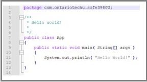

# Lab 1: Software Project Management and Comprehension Tool (Apache Maven)
## repostory link

## Objective: 
1. Install Maven in Windows OS.
2. Be familiar with Maven as a software project management.
3. Understand how to create, configure and build Maven projects

## What’s Maven?
It’s A tool for building and managing any type of java-based project.
It also can be used to build projects written in C#, Scala, Ruby, etc. 
Maven not only automatically handles the requirements for the project 
like downloading the dependencies, but it also automates most of the 
development tasks in the project like:
* Builds
* Dependencies
* Report
* Distribution
* Releases
* Mailing list
## Maven Installation
* Have a JDK installed on your system. It should satisfy [the minimum requirement](https://maven.apache.org/download.cgi#system-requirements). 
*	set the **JAVA_HOME** environment variable pointing to your JDK installation. 
    1.	On the Windows taskbar, right-click the **Windows icon** and select **System**.
    2.	In the Settings window, under** Related Settings**, click **Advanced system settings…** .
    3.	On the **Advanced** tab, click **Environment Variables…** .
    4.	Click **New** to create a new environment variable for the current user.
    5.	Set the **Variable name** to **JAVA_HOME** and the **Variable value** to the installation path (it would be different than that shown in the figure). The **bin** folder containing **java.exe** should be accessed by the path.
    
    6.	To check it, open a new command window and execute  
    ``echo %JAVA_HOME%``  
    It should display the JDK path
* Download the **Binary zip archive** format of [Maven](https://maven.apache.org/download.cgi#files) then uncompress it to a certain folder
*  this path to the path
    1.	Go to the **Environment variables** for the user as you did before.
    2.	Find an existing **Path** Variable. Then click **edit**.
    3.	Add a new record of the path of the **bin** folder within the **Maven** folder. (the path would like different than that shown in the figure)
    
 * Check the correct Installation, by running the following command in a new command window (Note any change in the user variables will effect only new command windows)  
``mvn -v``  
It should display an output similar to  

## Creating a project
* Within a command window, change the directory to the folder in which you want to create the project (replace **projects_root** with the actual path of the folder)  
``cd <projects_root>``
* Create a new project using the following command  
```
mvn archetype:generate^
    -DgroupId=com.ontariotechu.sofe3980U ^
    -DartifactId=BinaryCalculator^
    -Dversion=1.0.0^
    -DarchetypeArtifactId=maven-archetype-quickstart^
    -DarchetypeVersion=1.4^
    -DinteractiveMode=false  
```

&nbsp;&nbsp;&nbsp;&nbsp;This is a multiline single command. Appending each line by **^** indicates that the command is not ended, and it will be extended to the next line. **archetype:generate** specify that the command will generate a new project. **maven-archetype-quickstart** and **1.4** are template type and template version, respectively, that will be used to create the project. While **DgroupId**, **DartifactId**, and **Dversion** are the group id, project name, and project version, respectively. Group id is a unique Identification for different projects within an organization.  
&nbsp;&nbsp;&nbsp;&nbsp; The command will create a folder with the same name as the project (**BinaryCalculator**). Within the project folder, a Project Object Model (POM) file (**pom.xml**) is created that contains a configuration script that controls the development cycle of the project. Also, a folder called **src** is created that contains two sub-directories, **main** for the source code and **test** for the testing code. The sub-folder names within both the main and test folders follow the **DgroupId** argument used to generate the project as shown in the following figure.  
  
&nbsp;&nbsp;&nbsp;&nbsp; A default HelloWorld java App will be created for you (**App.java**) as well as a default test file (**AppTest.java**). You can edit the files using any text editor. The content of the App.java file should look like this:  
   
## Building the project:
* Change the directory to the path of the pom.xml file  
``cd BinaryCalculator``  
* Run the following command  
``mvn clean package``  
&nbsp;&nbsp;&nbsp;&nbsp; the first argument (**clean**) will remove any previously generated output while the **package** argument will rebuild the project and produce a jar file for the whole project. During the packaging process, the tests will be executed. All tests should be passed to complete the building process. All outputs including the jar file will be saved at the path (**BinaryCalculator\target**). The name of the built jar file will follow the pattern **DartifactId-Dversion.jar**. Thus it should be **BinaryCalculator-1.0.0.jar** for this project.
