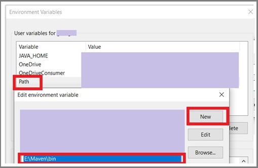

# Lab 1: software project management and comprehension tool (Apache Maven)

## Objective: 
1. Be familiar with Maven as a software project management.
2.

## What’s Maven?
It’s A tool for building and managing any type of java-based projects.
It also can be used to build projects written in C#, Scala, Ruby, etc. 
Maven not only automatically handles the requirements for the project 
like downloading the dependencies, but it also automates most of the 
development tasks in the project like:
* Builds
* Dependencies
* Report
* Distribution
* Releases
* Mailing list
## Maven Installation
* Have a JDK installation on your system. It should satisfy [the minimum requirement](https://maven.apache.org/download.cgi#system-requirements). 
*	set the **JAVA_HOME** environment variable pointing to your JDK installation. 
    1.	On the Windows taskbar, right-click the **Windows icon** and select **System**.
    2.	In the Settings window, under** Related Settings**, click **Advanced system settings…** .
    3.	On the **Advanced** tab, click **Environment Variables…** .
    4.	Click **New** to create a new environment variable for the current user.
    5.	Set the **Variable name** to **JAVA_HOME** and the **Variable value** to the installation path (it would be different than that shown in the figure). The **bin** folder having **java.exe** file should be accessed by the path.
    
    6.	To check it, open a new command window and execute  
    ``echo %JAVA_HOME%``  
    It should display the JDK path
* Download the Binary zip archive format of Maven then uncompressing it to a certain folder
*  this path to the path
    1.	Go to the **Environment variables** for the user as you did before.
    2.	Find an existing **Path** Variable. Then click **edit**.
    3.	Add a new record of the path of the **bin** folder within **Maven** folder. (the path would like different than that shown in the figure)
    
